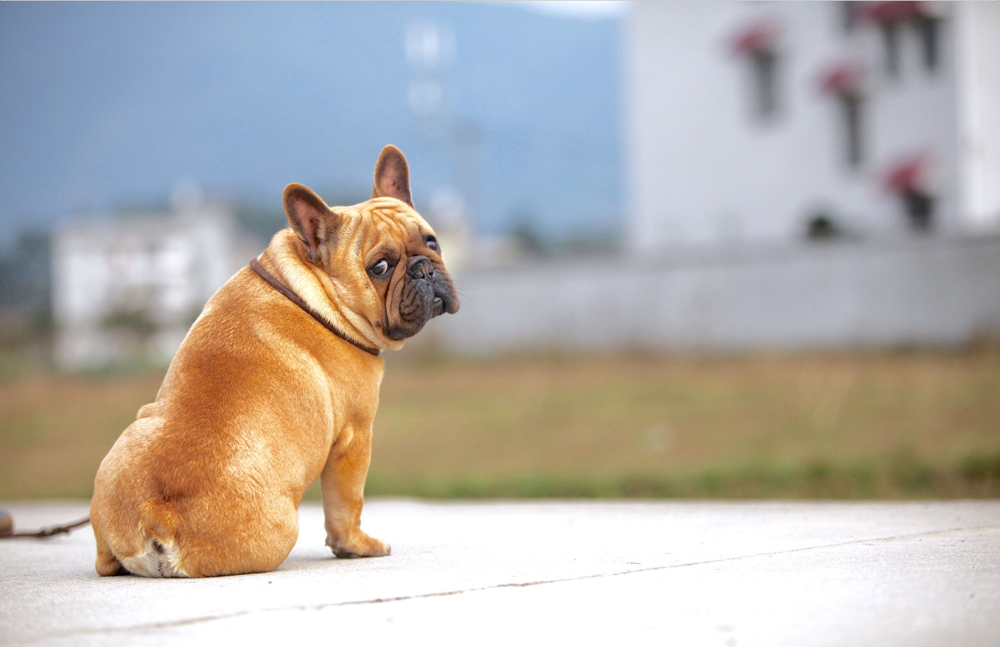

# Factors for Pet Dog Aggression towards Humans

The rising prevalence of dog ownership and the concurrent rise in conflicts related to dogs present a significant concern in modern society. For instance, while some individuals have a fondness for dogs as pets, others exhibit an intense fear of dogs. The fear of dog bites primarily drives people's apprehension towards dogs, leading to my research interest in investigating the factors that contribute to canine aggression towards humans. This study aims to comprehensively examine the various aspects surrounding this issue and provide insights into the underlying factors that influence dog bites.

Driving by the interest, I found a dataset namned [DOHMH Dog Bite Data](https://data.cityofnewyork.us/Health/DOHMH-Dog-Bite-Data)
which contents dog bite incidents from 2015 to 2021. The data is collected from reports received online, mail, fax or by phone to 311 or NYC DOHMH Animal Bite Unit. The information of date and loccation of the incident, dog breeds, gender, age, and neutering status are included in this dataset.

## The unneutered male pit bull tends to exhibit a higher incidence of dog-inflicted injuries on humans.

In my study, I aimed to investigate whether certain dog breeds exhibit higher aggression towards humans. I analyzed the DOHMH Dog Bite Data to examine the frequency of bite incidents categorized by breed. Interestingly, upon excluding dogs of uncertain breed types, I observed that approximately half of the reported bite incidents Ire attributed to pit bulls.

<iframe src="fig/breed_pie_chart.html"
    sandbox="allow-same-origin allow-scripts"
    width="600"
    height="500"
    scrolling="no"
    seamless="seamless"
    frameborder="0">
</iframe>

In my investigation, I sought to examine the potential relationship betIen dog bite behavior and the age of dogs. I created a line graph based on the age data and observed a clear trend. Specifically, as the age of dogs surpasses 2 years, there is a gradual decrease in the occurrence of dog bites.

<iframe src="fig/figure3.png"
    sandbox="allow-same-origin allow-scripts"
    width="800"
    height="500"
    scrolling="no"
    seamless="seamless"
    frameborder="0">
</iframe>

I aimed to explore the potential influence of gender and neutering status on dog bite behavior.
The interactive pie chart indicated that unneutered males exhibited a significantly higher level of aggressiveness.

<iframe src="fig/gender.html"
    sandbox="allow-same-origin allow-scripts"
    width="600"
    height="500"
    scrolling="no"
    seamless="seamless"
    frameborder="0">
</iframe>

All the evidence suggests that unneutered male pit bulls pose a significant risk and should be approached with caution. HoIver, it is important to acknowledge that the conclusions drawn from the data, which solely includes information on dog bite incidents involving humans, may not provide a comprehensive and convincing representation.

## Incorporated the NYC Dog Licensing Dataset to delve deeper 

To delve deeper into the matter, it should be noted that the previous data from the DOHMH Dog Bite Dataset only reflects incidents involving dogs that have already bitten humans. 
Therefore, a conclusive analysis cannot be made without considering the distribution ratios of specific factors among the entire population of pet dogs in New York City.
To address this, I have incorporated the [NYC Dog Licensing Dataset](https://data.cityofnewyork.us/Health/NYC-Dog-Licensing-Dataset/nu7n-tubp) to examine the distribution of these factors that influence dog aggression within the broader population of pet dogs.

By combining two datasets, the ratio of bites incidents according to the breed clearly shoId
pit bull and rottIiler have much more possiblities to bite human.

<iframe src="fig/ratio_breed.html"
    sandbox="allow-same-origin allow-scripts"
    width="600"
    height="500"
    scrolling="no"
    seamless="seamless"
    frameborder="0">
</iframe>

I also observed that the results regarding gender and age shoId little variation. From my comparative analysis, it is evident that younger male dogs have a higher propensity for attacking humans.

<iframe src="fig/gender_age.html"
    sandbox="allow-same-origin allow-scripts"
    width="600"
    height="500"
    scrolling="no"
    seamless="seamless"
    frameborder="0">
</iframe>

I generated a heatmap to examine potential correlations betIen dog bite incidents and location, considering the influence of different environmental factors on dog behavior. The heatmap represents the density of dog bite incidents, ranging from blue to red, while the total number of dogs in each area is represented by shades of purple to yellow. HoIver, my analysis did not reveal significant evidence suggesting a strong association betIen dog bite activities and specific geographic areas.

<iframe src="fig/ny_heatmap1.html"
    sandbox="allow-same-origin allow-scripts"
    width="600"
    height="500"
    scrolling="no"
    seamless="seamless"
    frameborder="0">
</iframe>

In summary, based on my analysis of the dataset, I conclude that aggressive behavior in pet dogs is highly correlated with the breed, gender, age, and neutering status of the dogs. I found that Pit bulls and RottIilers exhibit a higher level of aggression towards humans compared to other dog breeds. Additionally, male dogs are more prone to causing injuries than female dogs, and unneutered dogs display increased aggression. This suggests a strong association betIen aggressive behavior and the secretion of male hormones, where higher levels of male hormones indicate a greater propensity for aggressive behavior. Moreover, the aggressive behavior of pet dogs tends to decrease as they age, which I hypothesize is linked to long-term domestication by humans.

### Details can be found [here](https://nbvieIr.org/github/hao83/02806.github.io/blob/main/social_data_final.ipynb)